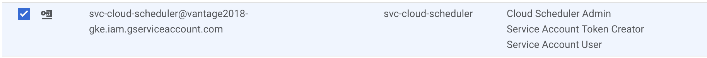
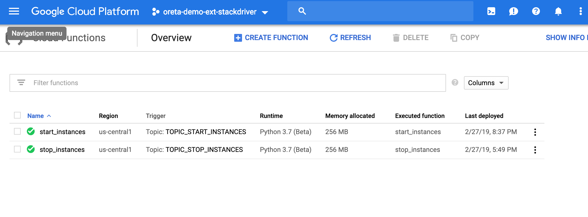
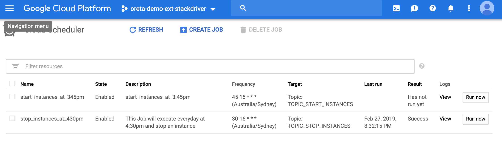
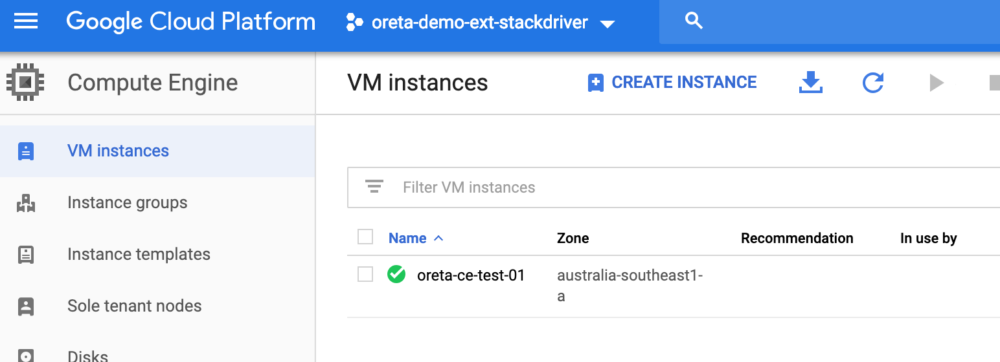

# Step by step Guide 

### Table of contents

- [Step by step Guide](#step-by-step-guide)
 
    - [1. Intiallize your gcloud to work in your project ](#1-intiallize-your-gcloud-to-work-in-your-project)
  
    - [2. Create a service account with 3 roles](#2-create-a-service-account-with-3-roles)
    - [3. Deploy Cloud Functions that will also create a pub_sub topic](#3-deploy-cloud-functions-that-will-also-create-a-pubsub-topic)
    - [4. Use python to deploy cloud scheduler](#4-Use-python-to-deploy-cloud-scheduler)


### 1. Intiallize your gcloud to work in your project

**Command :**  

`# gcloud init`

**OUTPUT :**

```Welcome! This command will take you through the configuration of gcloud.

Settings from your current configuration [oreta-schd] are:
compute:
  region: australia-southeast1
  zone: australia-southeast1-a
core:
  account: don@oreta.com.au
  disable_usage_reporting: 'False'
  project: oreta-demo-ext-stackdriver

Pick configuration to use:
 [1] Re-initialize this configuration [oreta-schd] with new settings
 [2] Create a new configuration
 [3] Switch to and re-initialize existing configuration: [cloudnnative]
 [4] Switch to and re-initialize existing configuration: [default]
 [5] Switch to and re-initialize existing configuration: [donoreta]
 [6] Switch to and re-initialize existing configuration: [dontechlabs]
 [7] Switch to and re-initialize existing configuration: [oreta]
 [8] Switch to and re-initialize existing configuration: [oreta-deployments]
 [9] Switch to and re-initialize existing configuration: [oretamich]
Please enter your numeric choice:

```
Select anyone that makes sense ,an example below

`Please enter your numeric choice:  2`

```
Enter configuration name. Names start with a lower case letter and
contain only lower case letters a-z, digits 0-9, and hyphens '-': test-config
Your current configuration has been set to: [test-config]

You can skip diagnostics next time by using the following flag:
  gcloud init --skip-diagnostics

Network diagnostic detects and fixes local network connection issues.
Checking network connection...done.
Reachability Check passed.
Network diagnostic passed (1/1 checks passed).

Choose the account you would like to use to perform operations for
this configuration:
 [1] don@oreta.com.au
 [2] Log in with a new account
Please enter your numeric choice:  1

You are logged in as: [don@oreta.com.au].

Pick cloud project to use:
 [1] xyz-232305
 .
 .
 .

 [24] oreta-demo-ext-stackdriver
 .
 .
 .
 [34] Create a new project
Please enter numeric choice or text value (must exactly match list
item):  24

Your current project has been set to: [oreta-demo-ext-stackdriver].

Do you want to configure a default Compute Region and Zone? (Y/n)?  y

Which Google Compute Engine zone would you like to use as project
default?
If you do not specify a zone via a command line flag while working
with Compute Engine resources, the default is assumed.
 [1] us-east1-b
 [2] us-east1-c
 [3] us-east1-d
 [4] us-east4-c
 [5] us-east4-b
 [6] us-east4-a
 [7] us-central1-c
 [8] us-central1-a
 [9] us-central1-f
 [10] us-central1-b
 [11] us-west1-b
 [12] us-west1-c
 [13] us-west1-a
 [14] europe-west4-a
 [15] europe-west4-b
 [16] europe-west4-c
 [17] europe-west1-b
 [18] europe-west1-d
 [19] europe-west1-c
 [20] europe-west3-c
 [21] europe-west3-a
 [22] europe-west3-b
 [23] europe-west2-c
 [24] europe-west2-b
 [25] europe-west2-a
 [26] asia-east1-b
 [27] asia-east1-a
 [28] asia-east1-c
 [29] asia-southeast1-b
 [30] asia-southeast1-a
 [31] asia-southeast1-c
 [32] asia-northeast1-b
 [33] asia-northeast1-c
 [34] asia-northeast1-a
 [35] asia-south1-c
 [36] asia-south1-b
 [37] asia-south1-a
 [38] australia-southeast1-b
 [39] australia-southeast1-c
 [40] australia-southeast1-a
 [41] southamerica-east1-b
 [42] southamerica-east1-c
 [43] southamerica-east1-a
 [44] asia-east2-a
 [45] asia-east2-b
 [46] asia-east2-c
 [47] europe-north1-a
 [48] europe-north1-b
 [49] europe-north1-c
 [50] northamerica-northeast1-a
Did not print [6] options.
Too many options [56]. Enter "list" at prompt to print choices fully.
Please enter numeric choice or text value (must exactly match list
item):  40

Your project default Compute Engine zone has been set to [australia-southeast1-a].
You can change it by running [gcloud config set compute/zone NAME].

Your project default Compute Engine region has been set to [australia-southeast1-a].
You can change it by running [gcloud config set compute/region NAME].

Your Google Cloud SDK is configured and ready to use!

* Commands that require authentication will use don@oreta.com.au by default
* Commands will reference project `oreta-demo-ext-stackdriver` by default
* Compute Engine commands will use region `australia-southeast1-a` by default
* Compute Engine commands will use zone `australia-southeast1-a` by default

Run `gcloud help config` to learn how to change individual settings

This gcloud configuration is called [test-config]. You can create additional configurations if you work with multiple accounts and/or projects.
Run `gcloud topic configurations` to learn more.

Some things to try next:

* Run `gcloud --help` to see the Cloud Platform services you can interact with. And run `gcloud help COMMAND` to get help on any gcloud command.
* Run `gcloud topic --help` to learn about advanced features of the SDK like arg files and output formatting
`
```

### 2. Create a service account with 3 roles 

**ROLES:**
```
Cloud Scheduler admin
service account token creator
service account user
```
  
  `Example:`
 
                 

### 3. Deploy Cloud Functions that will also create a pub_sub topic

 **STEP 1:  Change directory to cloud_functions and check if main.py file exists.**

```
Command : `✗ cd /tmp/gcp-pubsub-funcs-scheduler/cloud_functions/cloudfunction_start_instance `

Command : ✗ ls

Output : 
          main.py          requirements.txt
```

**STEP 2:  Use gcloud to deploy the function**

**Command Options:**
```
✗ gcloud functions deploy < Name of your cloud function > --runtime python37 --trigger-resource < Name of your pub/sub Topic > --trigger-event google.pubsub.topic.publish 
```

- deploy : < Name of your cloud function >
- --runtime : <You can choose from `Node.js v6` ,`Nodejs v8` & `Python3.7`>
- --trigger-resource :< Name of your pub/sub Topic >
- --trigger-event : < How do you want to trigger it eg. by publishing to pubsub >

- where TOPIC_NAME is the name of the Cloud Pub/Sub topic to which the function will be subscribed. If the topic doesn't exist, it is created during deployment.

 **To deploy start_function**

```
Command: ✗ gcloud functions deploy start_instances --runtime python37 --trigger-resource TOPIC_START_INSTANCES --trigger-event google.pubsub.topic.publish 


OUTPUT :


        Deploying function (may take a while - up to 2 minutes)...done.
        availableMemoryMb: 256
        entryPoint: start_instances
        eventTrigger:
          eventType: google.pubsub.topic.publish
          failurePolicy: {}
          resource: projects/oreta-demo-ext-stackdriver/topics/TOPIC_START_INSTANCES
          service: pubsub.googleapis.com
        labels:
          deployment-tool: cli-gcloud
        name: projects/oreta-demo-ext-stackdriver/locations/us-central1/functions/start_instances
        runtime: python37
        serviceAccountEmail: oreta-demo-ext-stackdriver@appspot.gserviceaccount.com
        sourceUploadUrl: https://storage.googleapis.com/gcf-upload-us-central1-90cd7752-7314-4145-8fb8-a41b0cfec3f1/6653e651-e4bc-4b3e-bc40-952fa4d491b9.zip?GoogleAccessId=service-890138433215@gcf-admin-robot.iam.gserviceaccount.com&Expires=1551262006&Signature=arzU02ToRHvEhB5mCLfEVwV38aTDXzWXl2L%2FTfvjBF1aFs4Iu4Vufb0M%2BzJO8o54N7ssawcNO%2BGZbIt6anLyJDLwYSrgyvOmnauqOyJB4hCmXqD2UUdbaLjkWamQbWqE21vDfc%2BWATxc2DQYyDOmM1GCLYwsWJcwygAJTlTzx8wc5s2S9rfRHvgfbseKYwrACZJm26LyB14WUS9h5qm8W1isPbATL0cJ7yGKgeXqxQR9Bn4WMBxaR29NI08WJhqUZfyyzr6xhRs3dE8cLzqPv%2B%2FRJCJk3Jza9k3XhbQAj1Whdgv3ID7lqYlBsO41OsdoxJjfgDPkxFAmlxfZhW%2FSJw%3D%3D
        status: ACTIVE
        timeout: 60s
        updateTime: '2019-02-27T09:37:39Z'
        versionId: '2'
```
**Console Output:** 



### 4. Use python to deploy cloud scheduler

```
Command:  ✗ cd /tmp/gcp-pubsub-funcs-scheduler/cloud_scheduler
Command:  ✗ ls

Output:

        cloud_scheduler_get_instances.py   cloud_scheduler_stop_instances.py
        cloud_scheduler_start_instances.py requirements.txt


```
**STEP 4.1 update the below variables in** `cloud_scheduler_start_instances.py`

- `SERVICE_ACCOUNT_FILE`: provide the <service_account.json> file that you download while creating the service account. place that file under `/gcp-pubsub-funcs-scheduler/auth`  directory.
- `PROJECT_ID `: project id where you want to deploy the cloud scheduler
- `LOCATION_ID`: where you want the scheduler to run
- `JOB_NAME`: name of the scheduler job
- `"instance_id"`: name of the instance
- `"zone_id"`: zone where the compute instance is deployed
- `"description"`: description of the job,
- `"schedule"`: cron format  min(0-59) ,hour(0-23), day of month(1-31), month of year(1-12),Day of the week(0-7) sec eg. `"45 15 *  * *"`
  
**Example inputs**
```
SERVICE_ACCOUNT_FILE = '../auth/firewall-management-dd391be3d8df.json'

PROJECT_ID = "oreta-demo-ext-stackdriver"
LOCATION_ID = "australia-southeast1"
JOB_NAME = 'start_instances_at_345pm'
.
.
.
"description": "start_instances_at_3:45pm",
"schedule": "45 15 *  * *",
"zone_id": "australia-southeast1-a",
"instance_id": "oreta-ce-test-01"
```
STEP 4.2 : deploy the scheduler code

```
Command: ✗ python cloud_scheduler_start_instances.py

 Output: <google.oauth2.service_account.Credentials object at 0x10dd647d0>
        projects/oreta-demo-ext-stackdriver/locations/australia-southeast1
        name: projects/oreta-demo-ext-stackdriver/locations/australia-southeast1/jobs/start_instances_at_345pm
        name: "projects/oreta-demo-ext-stackdriver/locations/australia-southeast1/jobs/start_instances_at_345pm"
        description: "start_instances_at_3:45pm"
        pubsub_target {
          topic_name: "projects/oreta-demo-ext-stackdriver/topics/TOPIC_START_INSTANCES"
          data: "Message number 24"
          attributes {
            key: "instance_id"
            value: "oreta-ce-test-01"
          }
          attributes {
            key: "project_id"
            value: "oreta-demo-ext-stackdriver"
          }
          attributes {
            key: "zone_id"
            value: "australia-southeast1-a"
          }
        }
        user_update_time {
          seconds: 1551266085
        }
        state: ENABLED
        schedule: "45 15 *  * *"
        time_zone: "Australia/Sydney"
```
**Console Output:**  Google cloud scheduler


**Console Output:**  Google compute engine started


